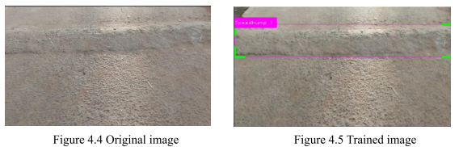
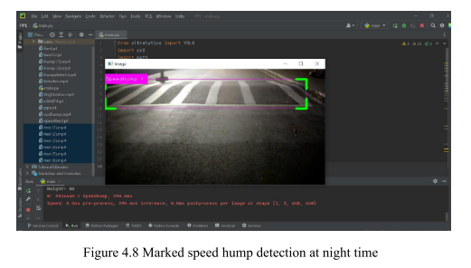
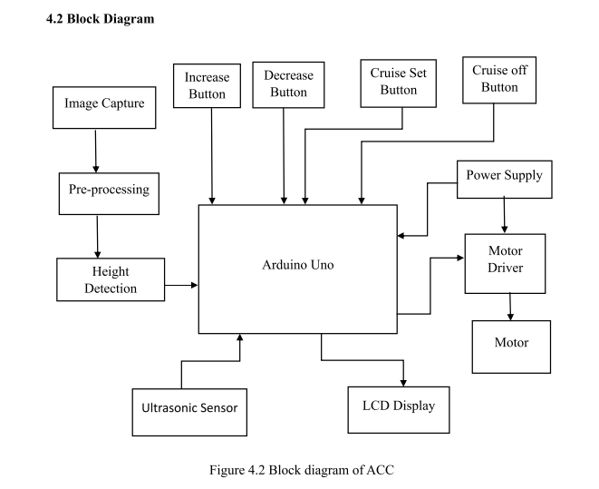
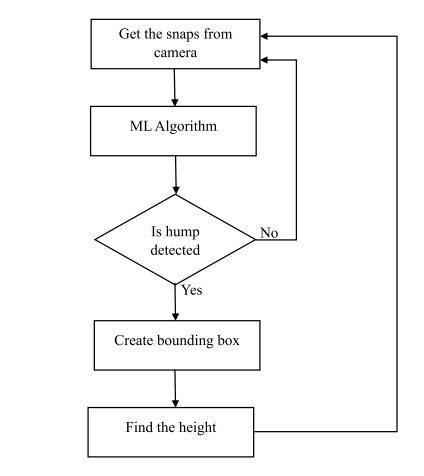
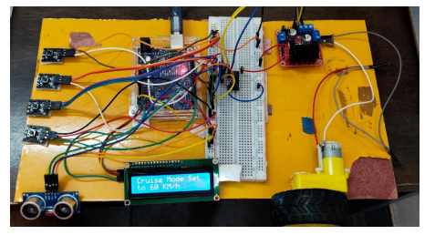
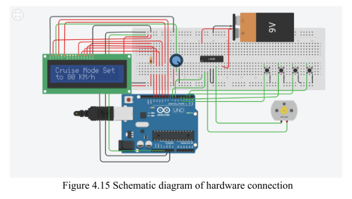

# Advanced Cruise Control using YOLOv8

## About the Project

This project was developed as the final year project for my Bachelor's degree in Electronics and Communication Engineering. The objective was to design an Advanced Cruise Control system capable of detecting road speed humps in real time using a custom-trained YOLOv8 object detection model.

Unlike conventional cruise control systems that rely only on distance sensing, this prototype combines computer vision with embedded hardware to detect upcoming speed humps and dynamically adjust vehicle speed. The complete workflow includes dataset collection, manual image annotation, model training, testing under different road conditions, and hardware integration using Arduino.

## Technologies Used

- Python
- YOLOv8
- LabelImg
- Google Colab
- Arduino IDE
- Arduino Uno
- Ultrasonic Sensor
- LCD Display
- Motor Driver

## Features

- Detects road speed humps using a custom-trained YOLOv8 object detection model.
- Uses a manually collected and annotated dataset for model training.
- Evaluates detection performance across different lighting and road conditions.
- Integrates computer vision with an Arduino-based adaptive cruise control prototype.
- Demonstrates the complete workflow from dataset creation to hardware implementation.

## Dataset Preparation

A custom dataset containing over **500 road images** was collected from different locations. Images were captured under various road and lighting conditions, including daytime, nighttime, marked, and unmarked speed humps.

The dataset was manually annotated using **LabelImg**, where bounding boxes were created for every speed hump before training the YOLOv8 model.

## Model Training

The annotated dataset was trained using the **YOLOv8** object detection framework in **Google Colab**. The trained model was evaluated on multiple test images to verify its ability to detect speed humps under varying environmental conditions.

## Hardware Integration

The trained detection model was integrated with an Arduino-based prototype consisting of an ultrasonic sensor, LCD display, motor driver, and DC motor setup. Based on the detected road condition, the prototype demonstrates adaptive vehicle speed control.

---

## Detection Results

The trained YOLOv8 model was evaluated under different road and lighting conditions to verify its ability to detect road speed humps accurately.

### Original vs Detected Image

The model successfully identifies the speed hump by generating a bounding box around the detected object.

### Night-Time Detection

The trained model was also evaluated under low-light conditions, demonstrating reliable detection performance during nighttime.

---

## System Architecture

The proposed system combines computer vision and embedded hardware to detect road speed humps and control vehicle speed in the prototype.

---

## Detection Workflow

The workflow below illustrates the complete detection pipeline, from image acquisition to speed hump detection and control decision.

---

## Hardware Prototype

The prototype integrates the trained detection system with an Arduino-based adaptive cruise control setup to demonstrate speed adjustment and obstacle handling.

### Circuit Diagram

The circuit diagram illustrates the hardware connections between the Arduino Uno, ultrasonic sensor, LCD display, motor driver, and DC motor.

---

## Future Improvements

- Expand the dataset with more road conditions and weather variations.
- Improve detection accuracy using larger and more diverse datasets.
- Integrate the system with real-time vehicle control hardware.
- Extend the system to detect additional road features such as potholes, lane markings, and traffic signs.

## Results

The proposed system successfully demonstrated real-time speed hump detection and adaptive speed control in a prototype environment. Testing under different road conditions showed the feasibility of combining computer vision and embedded systems for intelligent driver assistance.
